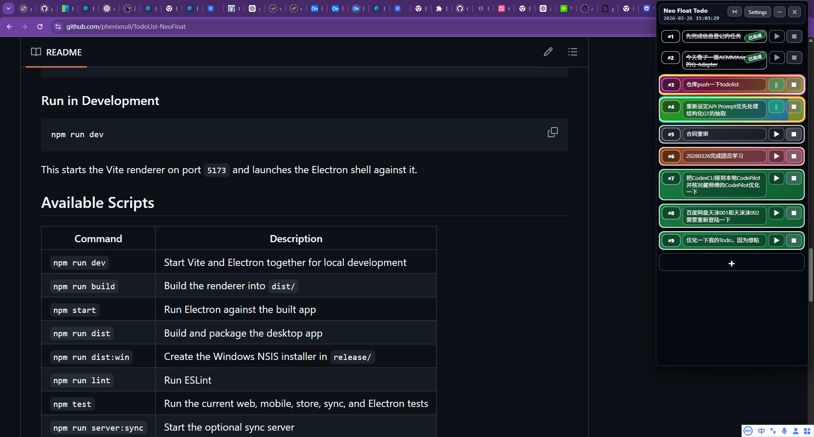

# Neo Float Todo

<p align="center">
  
</p>

<p align="center">
  A colorful Electron desktop app for managing personal to-do lists in a floating, always-on-top window.
</p>

<p align="center">
  
</p>

<p align="center">
  <sub>GitHub-ready showcase view of the floating desktop app</sub>
</p>

<p align="center">
  
  
  
  
  
  
</p>

<p align="center">
  
  
  
  
</p>

## Overview

Neo Float Todo is designed for people who want their task list visible without giving up screen space. It combines a frameless translucent desktop window, task timers, markdown rendering, attachment support, and optional sync tooling in one Windows-first app.

## Highlights

- Frameless transparent floating window with always-on-top behavior
- Edge docking and auto-hide behavior for a less intrusive desktop layout
- Rich task editing with markdown and math rendering via KaTeX
- Per-task colors, typography controls, and drag-and-drop sorting
- Start, pause, and multi-segment time tracking for each task
- Local persistence with snapshot files and append-only daily event logs
- Optional sync server plus mobile web client support
- Electron packaging flow for a Windows installer

## Tech Stack

<p>
  
  
  
  
  
  
  
</p>

## Quick Start

### Requirements

- Node.js 20+
- npm
- Windows environment for the Electron desktop app

### Install

```bash
npm install
```

### Run in Development

```bash
npm run dev
```

This starts the Vite renderer on port `5173` and launches the Electron shell against it.

## Available Scripts

| Command | Description |
| --- | --- |
| `npm run dev` | Start Vite and Electron together for local development |
| `npm run build` | Build the renderer into `dist/` |
| `npm start` | Run Electron against the built app |
| `npm run dist` | Build and package the desktop app |
| `npm run dist:win` | Create the Windows NSIS installer in `release/` |
| `npm run lint` | Run ESLint |
| `npm test` | Run the current web, mobile, store, sync, and Electron tests |
| `npm run server:sync` | Start the optional sync server |

## Project Structure

```text
.
|-- build/                 App icons and packaging assets
|-- deploy/server-sync/    Service and deployment helpers for the sync server
|-- electron/              Electron main process, preload bridge, and runtime helpers
|-- public/                Static public assets
|-- server/                Optional sync API
|-- src/
|   |-- components/        Desktop UI components
|   |-- lib/               Shared helpers and sync utilities
|   |-- mobile/            Mobile web client
|   |-- store/             Zustand task store
|   `-- types/             Shared TypeScript types
`-- tests/                 Automated tests for app and sync behavior
```

## Local Data and Sync

Runtime data is stored locally and intentionally excluded from Git:

- `data/state.snapshot.json`
- `data/events.YYYY-MM-DD.jsonl`
- `data/task-assets/`
- `.runtime/`

The repository contains app code and sync server code, but not personal task data.

## Build a Windows Installer

```bash
npm run dist:win
```

The packaged installer is generated under `release/`.

## Development Notes

- The desktop app entry point is `electron/main.cjs`
- The renderer starts from `src/main.tsx`
- Mobile web support lives in `mobile.html` and `src/mobile/`
- Sync behavior is implemented in `server/`, `src/lib/sync.ts`, and `electron/syncRuntime.cjs`

## Verification

```bash
npm run lint
npm test
```

## Update Log

### 2026-04-03

- Added per-task duration display controls with right-click actions for current-item show/hide, all-items show/hide, and explicit `single-line` vs `2+1` duration layouts.
- Added batch layout actions that apply the chosen duration layout to all currently visible tasks without touching hidden task records.
- Improved archive and hidden-task behavior so plain archive state can stay visible, archive-and-hide remains available, and hidden archived task filtering supports date ranges.
- Added backward-compatible duration normalization for desktop and mobile persisted state so older tasks can recover `totalDurationMs` and newer layout metadata safely.
- Made the desktop context menu scrollable in small windows and fixed internal menu scrolling so wheel input does not immediately close the menu.
- Added Windows dev launch helpers (`start-dev.ps1`, `launch-dev-hidden.vbs`, updated `start-dev.bat`) for source-based startup and desktop shortcut workflows.

## Repository Goal

This repository tracks the application itself only. Generated output, machine-local runtime files, and personal to-do data are not committed.

## License

This project is licensed under `MIT`. See `LICENSE` for the full text.
